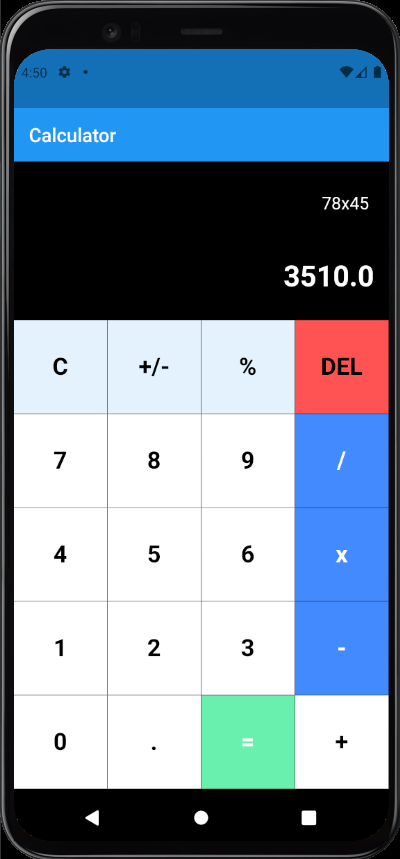

# SIMPLE CALCULATOR APP USING FLUTTER

In this project I built a simple calculator App that can perform basic Arithmetic operations like addition,
subtraction, multiplication or division depending upon the user Input.

Concepts used **Showing Widgets on the screen,**
              **Gridview.builder,**
              **Function Writing**

## Coding Calculator App

In the Lib folder, there is a **main.dart** file already present. And now in the same folder create a new file named **buttons.dart**. Starting with **main.dart** file. Create **MyApp** class and make it **StatelessWidget**. Add an array of buttons to be displayed. Set the background-color, text-color, text-color, functionality **onTapped** to the buttons.

In Flutter main.dart file is the entry point from which the code starts to executing. In the **main.dart** file firstly material design package has been imported in addition to **math_expressions** and **buttons.dart** file. Then a function runApp has been created with parameter as **MyApp**. After the declaration of class **MyApp** which is a stateless widget, the state of class **MyApp** has been laid out.  

## Building the buttons.dart

In **buttons.dart** which is already imported in **main.dart** file we are declaring variables that will be used throughout the program using a constructor. The color, text color, button text, and the functionality of the button on tapped will be implemented in **main.dart** file 

## Adding dependencies in pubspec.yaml file

To make the process easier we are using **math_expressions: ^2.0.0 ** package which is imported in **main.dart** file to handle all the calculations and run time error exceptions. 

